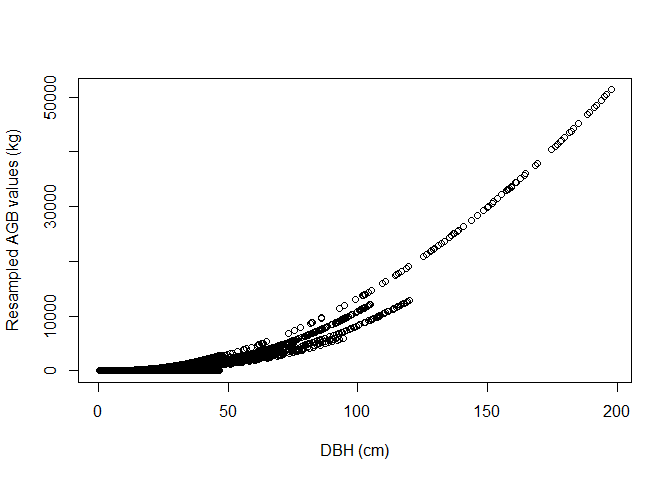
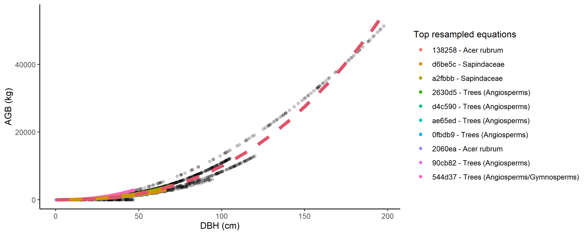

<!-- README.md is generated from README.Rmd. Please edit that file -->

```{r setup, echo = FALSE, message=FALSE, warning=FALSE}
set.seed(1014)

knitr::opts_chunk$set(
  comment = "#>",
  collapse = TRUE
)
```

#  allodb: An R database for biomass estimation at globally distributed extratropical forest plots

<!-- badges: start -->
[](https://www.tidyverse.org/lifecycle/#experimental)
[](https://travis-ci.org/forestgeo/allodb)
[](https://coveralls.io/r/forestgeo/allodb?branch=master)
[](https://cran.r-project.org/pkg=allodb)
[](https://github.com/forestgeo/allodb/actions)
<!-- badges: end -->

## Introduction

Allometric equations for calculation of tree aboveground biomass (AGB) form the basis for estimates of forest carbon storage and exchange with the atmosphere. While standard models exist to calculate forest biomass across the tropics, we lack a standardized tool for computing AGB across the global extratropics.

_allo-db_ was conceived as a framework to standardize and simplify the biomass estimation process across globally distributed extratropical forests. 
With _allo-db_ we aimed to: a) compile relevant published and unpublished allometries, focusing on AGB but structured to handle other variables (e.g., height and biomass components); b) objectively select and integrate appropriate available equations across the full range  of tree sizes; and c) serve as a platform for future updates and expansion to other research sites globally.

The _allodb_ package contains a database of systematically selected published allometric equations. The data component of the package is based on 701 woody species identified at 24 large ForestGEO forest dynamic plots representing all major extratropical forest types. A total of 549 parsed allometric equations to estimate individual tree biomass were retrieved, checked, and combined using a weighting function designed to ensure optimal equation selection over the full tree size range with smooth transitions across equations. The equation dataset used can be customized with built-in functions that subset the original dataset and add new equations.

The package also provides functions to estimate biomass based on user-provided census data (tree DBHs, taxonomic identification, and plot coordinates). New allometric equations are calibrated for each species and location by resampling the original equations; equations with a larger sample size and/or higher taxonomic and climatic similarity with the species and location in question are given a higher weight in this process. 

## Installation

Install the development version of _allo-db_ from GitHub:

```R
# install.packages("remotes")
remotes::install_github("forestgeo/allodb")
```

## Examples

Prior to calculating tree biomass using _allo-db_, users need to provide a table (i.e. dataframe) with DBH (cm), parsed species Latin names, and site(s) coordinates. In the following examples we use data from the Smithsonian Conservation Biology Institute, USA (SCBI) ForestGEO dynamics plot (1st census in 2008, trees from 1 hectare). Tree census data can be requested through the ForestGEO portal (https://forestgeo.si.edu/)

```{r open-data}
library(allodb)
data(scbi_stem1)
``` 

The biomass of all trees in one (or several) censuses can be estimated using the `get_biomass` function. 

```{r calc-agb-all}
scbi_stem1$agb <-
  get_biomass(
    dbh = scbi_stem1$dbh,
    genus = scbi_stem1$genus,
    species = scbi_stem1$species,
    coords = c(-78.2, 38.9)
  )
```

Biomass for a single tree can be estimated given dbh and species Id (results in kilograms).

```{r calc-agb-poplar}
get_biomass(
  dbh=50, 
  genus="liriodendron", 
  species="tulipifera", 
  coords=c(-78.2, 38.9)
)
```

Users can modify the set of equations that will be used to estimate the biomass using the `new_equations` function. The default option is the entire _allodb_ equation table. Users can also work on a subset of those equations, or add new equations to the table (see `?allodb::new_equations`). This new equation table should be provided as an argument in the `get_biomass` function.  

```{r}
show_cols <- c("equation_id", "equation_taxa", "equation_allometry")
eq_tab_acer <- new_equations(subset_taxa = "Acer")
head(eq_tab_acer[, show_cols])
```

Within the `get_biomass` function, this equation table is then used to calibrate a new allometric equation for all species/site combinations in the user-provided dataframe. This is done by attributing a weight to each equation based on its sampling size, and taxonomic and climatic similarity with the species/site combination considered. 

```{r weights}
allom_weights <-
  weight_allom(genus = "Acer",
               species = "rubrum",
               coords = c(-78, 38))

## visualize weights
equ_tab_acer <- new_equations()
equ_tab_acer$weights <- allom_weights
keep_cols <-
  c("equation_id",
    "equation_taxa",
    "sample_size",
    "weights")
order_weights <- order(equ_tab_acer$weights, decreasing = TRUE)
equ_tab_acer <- equ_tab_acer[order_weights, keep_cols]
head(equ_tab_acer)
```

Equations are then resampled within their original DBH range: the number of resampled values for each equation is proportional to its weight (as attributed by the `weight_allom` function). 

```{r resample-acer, eval = FALSE}
df_resample <-
  resample_agb(genus = "Acer",
               species = "rubrum",
               coords = c(-78, 38)
  )

plot(
  df_resample$dbh,
  df_resample$agb,
  xlab = "DBH (cm)",
  ylab = "Resampled AGB values (kg)"
)
```



The resampled values are then used to fit the following linear model: log(AGB) ~ log(DBH). The parameters (_a_ intercept, _b_ slope, and _sigma_ standard deviation of residuals) are returned by the `est_params` function. 

```{r est-params-acer, eval = FALSE}
pars_acer <- est_params(
  genus = "Acer",
  species = "rubrum",
  coords = c(-78, 38)
)
plot(
  df_resample$dbh,
  df_resample$agb,
  xlab = "DBH (cm)",
  ylab = "Resampled AGB values (kg)"
)
curve(pars_acer$a * x ^ pars_acer$b, add = TRUE, col = 2, lwd = 2)
```



The `est_params` function can be used for all species/site combinations in the dataset at once. 

```{r est-params-all}
params <- est_params(
  genus = scbi_stem1$genus,
  species = scbi_stem1$species,
  coords = c(-78.2, 38.9)
)
head(params)
```

AGB is then recalculated as `agb = a * dbh^b` within the `get_biomass` function. 


