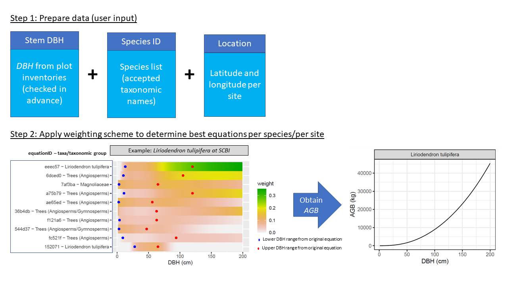

<!-- README.md is generated from README.Rmd. Please edit that file -->

```{r setup, echo = FALSE, message=FALSE, warning=FALSE}
set.seed(1014)

knitr::opts_chunk$set(
  comment = "#>",
  collapse = TRUE
)
```

#  allodb: An R database for biomass estimation at globally distributed extratropical forest plots

[](https://www.tidyverse.org/lifecycle/#experimental)
[](https://travis-ci.org/forestgeo/allodb)
[](https://coveralls.io/r/forestgeo/allodb?branch=master)
[](https://cran.r-project.org/pkg=allodb)


## Introduction

_allo-db_ was conceived as a framework to standardize and simplify the biomass estimation process across globally distributed extratropical forests. We were inspired by the lack of standards tree biomass calculation resources available for temperate sites within the Forest Global Earth Observatory (ForestGEO). With _allo-db_ we aimed to: a) compile relevant published and unpublished allometries, focusing on AGB but structured to handle other variables (e.g., height and biomass components);  b) objectively select and integrate appropriate available equations across the full range  of tree sizes; and c) serve as a platform for future updates and expansion to other research sites globally.


## Installation

Install the development version of _allo-db_ from GitHub:

```R
# install.packages("remotes")
remotes::install_github("forestgeo/allodb")
```


## Examples

Prior to calculating tree biomass using _allo-db_ users need to provide a table (i.e. dataframe) with DBH (cm), H (m; optional), parsed species Latin names, and site coordinates. A graph can be built per species/per site to visualize the function across an hypothetical DBH range. 

<br>
<p align="center"></p>
<p align="center"><sub>Figure 1. Diagram of allo-db workflow, including user input data and an example of weighting of available equations across the DBH size spectrum to produce a single, continuous function of AGB in relation to DBH. The top ten allometries (indicating equation ID and taxa/taxonomic group), after applying the weighting process, can be seen as a side panel</sub></p>
<br>


In this example we use data from the Smithsonian Conservation Biology Institute, USA (SCBI) ForestGEO dynamics plot (1st census in 2008, trees from 1 hectare). Data can be requested through the ForestGEO portal (https://forestgeo.si.edu/)

```R
library(allodb)

data(scbi_stem1)
scbi_stem1$agb <-
  get_biomass(
    dbh = scbi_stem1$dbh,
    genus = scbi_stem1$genus,
    species = scbi_stem1$species,
    coords = c(-78.2, 38.9)
)

```


You can also estimate biomass for a single tree given dbh and species Id.

```R
get_biomass(
  dbh=50, 
  genus="liriodendron", 
  species="tulipifera", 
  coords=c(-78.2, 38.9)
)
```
