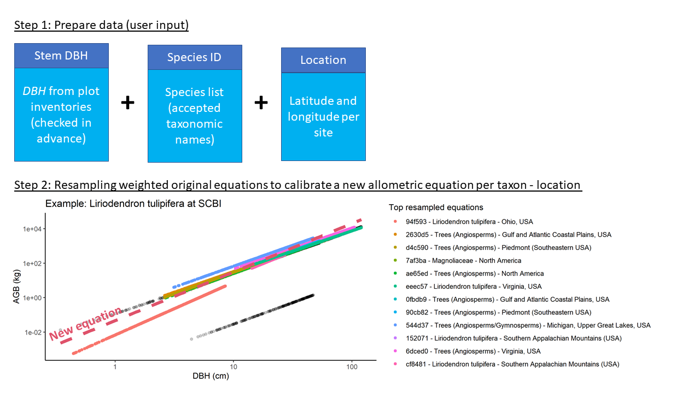
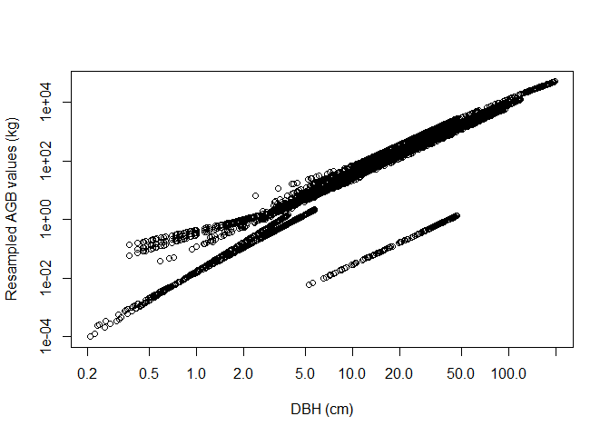
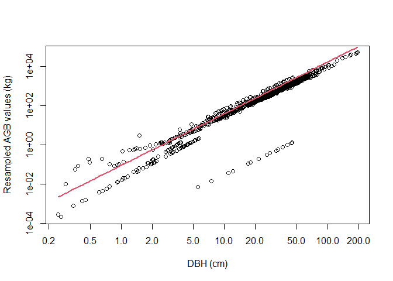

<!-- README.md is generated from README.Rmd. Please edit that file -->

#  allodb: An R database for biomass estimation at globally distributed extratropical forest plots

<!-- badges: start -->

[](https://www.tidyverse.org/lifecycle/#experimental)
[](https://travis-ci.org/forestgeo/allodb)
[](https://coveralls.io/r/forestgeo/allodb?branch=master)
[](https://cran.r-project.org/pkg=allodb)
[](https://github.com/forestgeo/allodb/actions)
<!-- badges: end -->

## Introduction

Allometric equations for calculation of tree aboveground biomass (AGB)
form the basis for estimates of forest carbon storage and exchange with
the atmosphere. While standard models exist to calculate forest biomass
across the tropics, we lack a standardized tool for computing AGB across
the global extratropics.

*allo-db* was conceived as a framework to standardize and simplify the
biomass estimation process across globally distributed extratropical
forests. With *allo-db* we aimed to: a) compile relevant published and
unpublished allometries, focusing on AGB but structured to handle other
variables (e.g., height and biomass components); b) objectively select
and integrate appropriate available equations across the full range of
tree sizes; and c) serve as a platform for future updates and expansion
to other research sites globally.

The *allodb* package contains a database of systematically selected
published allometric equations. The data component of the package is
based on 701 woody species identified at 24 large ForestGEO forest
dynamic plots representing all major extratropical forest types. A total
of 549 parsed allometric equations to estimate individual tree biomass
were retrieved, checked, and combined using a weighting function
designed to ensure optimal equation selection over the full tree size
range with smooth transitions across equations. The equation dataset
used can be customized with built-in functions that subset the original
dataset and add new equations.

The package also provides functions to estimate biomass based on
user-provided census data (tree DBHs, taxonomic identification, and plot
coordinates). New allometric equations are calibrated for each species
and location by resampling the original equations; equations with a
larger sample size and/or higher taxonomic and climatic similarity with
the species and location in question are given a higher weight in this
process.

The general workflow of the package is summarized in the following
figure. (xx change this figure to match new *allodb* version)

<br>
<p align="center">

</p>
<p align="center">
<sub>Figure 1. Diagram of allo-db workflow, including user input data
and an example of weighting of available equations across the DBH size
spectrum to produce a single, continuous function of AGB in relation to
DBH. The top ten allometries (indicating equation ID and taxa/taxonomic
group), after applying the weighting process, can be seen as a side
panel</sub>
</p>

<br>

## Installation

Install the development version of *allo-db* from GitHub:

``` r
# install.packages("remotes")
remotes::install_github("forestgeo/allodb")
```

## Examples

Prior to calculating tree biomass using *allo-db*, users need to provide
a table (i.e. dataframe) with DBH (cm), parsed species Latin names, and
site(s) coordinates. In the following examples we use data from the
Smithsonian Conservation Biology Institute, USA (SCBI) ForestGEO
dynamics plot (1st census in 2008, trees from 1 hectare). Tree census
data can be requested through the ForestGEO portal
(<https://forestgeo.si.edu/>)

``` r
library(allodb)
data(scbi_stem1)
```

The biomass of all trees in one (or several) censuses can be estimated
using the `get_biomass` function.

``` r
scbi_stem1$agb <-
  get_biomass(
    dbh = scbi_stem1$dbh,
    genus = scbi_stem1$genus,
    species = scbi_stem1$species,
    coords = c(-78.2, 38.9)
  )
```

Biomass for a single tree can be estimated given dbh and species Id
(results in kilograms).

``` r
get_biomass(
  dbh=50, 
  genus="liriodendron", 
  species="tulipifera", 
  coords=c(-78.2, 38.9)
)
#> [1] 2841.488
```

Users can modify the set of equations that will be used to estimate the
biomass using the `new_equations` function. The default option is the
entire *allodb* equation table. Users can also work on a subset of those
equations, or add new equations to the table (see
`?allodb::new_equations`). This new equation table should be provided as
an argument in the `get_biomass` function.

``` r
show_cols <- c("equation_id", "equation_taxa", "equation_allometry")
eq_tab_acer <- new_equations(subset_taxa = "Acer")
head(eq_tab_acer[, show_cols])
#>     equation_id       equation_taxa
#> 29       a4e4d1      Acer saccharum
#> 88       dfc2c7         Acer rubrum
#> 89       eac63e         Acer rubrum
#> 116      f49bcb Acer pseudoplatanus
#> 151      14bf3d   Acer mandshuricum
#> 152      0c7cd6           Acer mono
#>                                           equation_allometry
#> 29                     exp(-2.192-0.011*dbh+2.67*(log(dbh)))
#> 88                                   2.02338*(dbh^2)^1.27612
#> 89                                    5.2879*(dbh^2)^1.07581
#> 116                    exp(-5.644074+(2.5189*(log(pi*dbh))))
#> 151 0.0335*(dbh)^1.606+0.0026*(dbh)^3.323+0.1222*(dbh)^2.310
#> 152 0.0202*(dbh)^1.810+0.0111*(dbh)^2.740+0.1156*(dbh)^2.336
```

Within the `get_biomass` function, this equation table is then used to
calibrate a new allometric equation for all species/site combinations in
the user-provided dataframe. This is done by attributing a weight to
each equation based on its sampling size, and taxonomic and climatic
similarity with the species/site combination considered.

``` r
allom_weights <-
  weight_allom(genus = "Acer",
               species = "rubrum",
               coords = c(-78, 38))

## visualize weights
equ_tab_acer <- new_equations()
equ_tab_acer$weights <- allom_weights
keep_cols <-
  c("equation_id",
    "equation_taxa",
    "sample_size",
    "weights")
order_weights <- order(equ_tab_acer$weights, decreasing = TRUE)
equ_tab_acer <- equ_tab_acer[order_weights, keep_cols]
head(equ_tab_acer)
#>     equation_id       equation_taxa sample_size   weights
#> 177      138258         Acer rubrum         150 0.4150366
#> 64       d6be5c         Sapindaceae         243 0.3834078
#> 65       a2fbbb         Sapindaceae         200 0.3491456
#> 79       2630d5 Trees (Angiosperms)         886 0.2985151
#> 85       d4c590 Trees (Angiosperms)         549 0.2888162
#> 216      ae65ed Trees (Angiosperms)         289 0.2468962
```

Equations are then resampled within their original DBH range: the number
of resampled values for each equation is proportional to its weight (as
attributed by the `weight_allom` function).

``` r
df_resample <-
  resample_agb(genus = "Acer",
               species = "rubrum",
               coords = c(-78, 38)
  )

plot(
  df_resample$dbh,
  df_resample$agb,
  log = "xy",
  xlab = "DBH (cm)",
  ylab = "Resampled AGB values (kg)"
)
```

<!-- -->

The resampled values are then used to fit the following linear model:
log(AGB) \~ log(DBH). The parameters (*a* intercept, *b* slope, and
*sigma* standard deviation of residuals) are returned by the
`est_params` function.

``` r
pars_acer <- est_params(
  genus = "Acer",
  species = "rubrum",
  coords = c(-78, 38)
)
plot(
  df_resample$dbh,
  df_resample$agb,
  log = "xy",
  xlab = "DBH (cm)",
  ylab = "Resampled AGB values (kg)"
)
curve(exp(pars_acer$a) * x ^ pars_acer$b * exp(0.5 * pars_acer$sigma^2),
      add = TRUE, col = 2, lwd = 2)
```

<!-- -->

The `est_params` function can be used for all species/site combinations
in the dataset at once.

``` r
params <- est_params(
  genus = scbi_stem1$genus,
  species = scbi_stem1$species,
  coords = c(-78.2, 38.9)
)
head(params)
#>          genus     species  long  lat         a        b     sigma
#> 1:        Acer     negundo -78.2 38.9 -2.825065 2.614069 1.0087115
#> 2:        Acer      rubrum -78.2 38.9 -2.906226 2.639375 0.9787364
#> 3:   Ailanthus   altissima -78.2 38.9 -2.539061 2.499994 1.3038173
#> 4: Amelanchier     arborea -78.2 38.9 -2.464260 2.470997 1.1751264
#> 5:     Asimina     triloba -78.2 38.9 -2.539061 2.499994 1.3038173
#> 6:    Carpinus caroliniana -78.2 38.9 -2.439023 2.487171 1.1029199
```

AGB is then recalculated as `agb = exp(a) * dbh^b * exp(0.5 * sigma^2)`
within the `get_biomass` function.
