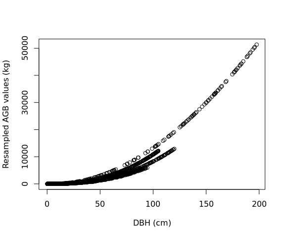
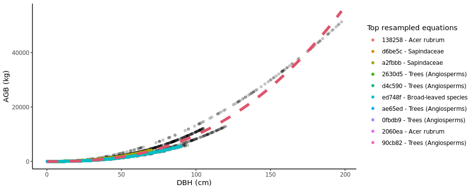

<!-- README.md is generated from README.Rmd. Please edit that file -->

#  allodb: An R package for biomass estimation at extratropical forest plots

<!-- badges: start -->

[](https://github.com/ropensci/software-review/issues/436)
[](https://codecov.io/gh/ropensci/allodb?branch=master)
[](https://github.com/ropensci/allodb/actions)
<!-- badges: end -->

## Introduction

Allometric equations for calculation of tree aboveground biomass (AGB)
form the basis for estimates of forest carbon storage and exchange with
the atmosphere. While standard models exist to calculate forest biomass
across the tropics, we lack a standardized tool for computing AGB across
the global extratropics.

*allodb* was conceived as a framework to standardize and simplify the
biomass estimation process across globally distributed extratropical
forests (mainly temperate and boreal forests). With *allodb* we aimed
to: a) compile relevant published and unpublished allometries, focusing
on AGB but structured to handle other variables (e.g., height); b)
objectively select and integrate appropriate available equations across
the full range of tree sizes; and c) serve as a platform for future
updates and expansion to other research sites.

The *allodb* package contains a dataset of systematically selected
published allometric equations. This dataset was built based on 701
woody species identified at 24 large [ForestGEO forest dynamic
plots](https://forestgeo.si.edu/) representing all major extratropical
forest types. A total of 570 parsed allometric equations to estimate
individual tree biomass were retrieved, checked, and combined using a
weighting function designed to ensure optimal equation selection over
the full tree size range with smooth transitions across equations. The
equation dataset used can be customized with built-in functions that
subset the original dataset and add new equations.

The package provides functions to estimate tree biomass based on
user-provided census data (tree diameter, taxonomic identification, and
plot coordinates). New allometric equations are calibrated for each
species and location by resampling the original equations; equations
with a larger sample size and/or higher taxonomic and climatic
similarity with the species and location in question are given a higher
weight in this process.

## Installation

Install the development version of *allodb* from GitHub:

``` r
# install.packages("remotes")
remotes::install_github("ropensci/allodb")
```

## Examples

Prior to calculating tree biomass using *allodb*, users need to provide
a table (i.e. dataframe) with DBH (cm), parsed species Latin names, and
site(s) coordinates. In the following examples we use data from the
Smithsonian Conservation Biology Institute, USA (SCBI) ForestGEO
dynamics plot (trees from 1 hectare surveyed in 2008). Full tree census
data can be requested through the [ForestGEO
portal](https://forestgeo.si.edu/explore-data).

``` r
library(allodb)
data(scbi_stem1)
```

The biomass of all trees in one (or several) censuses can be estimated
using the `get_biomass` function.

``` r
scbi_stem1$agb <-
  get_biomass(
    dbh = scbi_stem1$dbh,
    genus = scbi_stem1$genus,
    species = scbi_stem1$species,
    coords = c(-78.2, 38.9)
  )
```

Biomass for a single tree can be estimated given dbh and species
identification (results in kilograms).

``` r
get_biomass(
  dbh = 50,
  genus = "liriodendron",
  species = "tulipifera",
  coords = c(-78.2, 38.9)
)
#> [1] 1578.644
```

Users can modify the set of equations that will be used to estimate the
biomass using the `new_equations` function. The default option is the
entire *allodb* equation table. Users can also work on a subset of those
equations, or add new equations to the table (see
`?allodb::new_equations`). This new equation table should be provided as
an argument in the `get_biomass` function.

``` r
show_cols <- c("equation_id", "equation_taxa", "equation_allometry")
eq_tab_acer <- new_equations(subset_taxa = "Acer")
head(eq_tab_acer[, show_cols])
#> # A tibble: 6 × 3
#>   equation_id equation_taxa       equation_allometry                            
#>   <chr>       <chr>               <chr>                                         
#> 1 a4e4d1      Acer saccharum      exp(-2.192-0.011*dbh+2.67*(log(dbh)))         
#> 2 dfc2c7      Acer rubrum         2.02338*(dbh^2)^1.27612                       
#> 3 eac63e      Acer rubrum         5.2879*(dbh^2)^1.07581                        
#> 4 f49bcb      Acer pseudoplatanus exp(-5.644074+(2.5189*(log(pi*dbh))))         
#> 5 14bf3d      Acer mandshuricum   0.0335*(dbh)^1.606+0.0026*(dbh)^3.323+0.1222*…
#> 6 0c7cd6      Acer mono           0.0202*(dbh)^1.810+0.0111*(dbh)^2.740+0.1156*…
```

Within the `get_biomass` function, this equation table is used to
calibrate a new allometric equation for all species/site combinations in
the user-provided dataframe. This is done by attributing a weight to
each equation based on its sampling size, and taxonomic and climatic
similarity with the species/site combination considered.

``` r
allom_weights <-
  weight_allom(
    genus = "Acer",
    species = "rubrum",
    coords = c(-78, 38)
  )

## visualize weights
equ_tab_acer <- new_equations()
equ_tab_acer$weights <- allom_weights
keep_cols <-
  c(
    "equation_id",
    "equation_taxa",
    "sample_size",
    "weights"
  )
order_weights <- order(equ_tab_acer$weights, decreasing = TRUE)
equ_tab_acer <- equ_tab_acer[order_weights, keep_cols]
head(equ_tab_acer)
#> # A tibble: 6 × 4
#>   equation_id equation_taxa        sample_size weights
#>   <chr>       <chr>                      <dbl>   <dbl>
#> 1 138258      Acer rubrum                  150   0.415
#> 2 d6be5c      Sapindaceae                  243   0.383
#> 3 a2fbbb      Sapindaceae                  200   0.349
#> 4 2630d5      Trees (Angiosperms)          886   0.299
#> 5 d4c590      Trees (Angiosperms)          549   0.289
#> 6 ed748f      Broad-leaved species        2223   0.270
```

Equations are then resampled within their original DBH range: the number
of resampled values for each equation is proportional to its weight (as
attributed by the `weight_allom` function).

``` r
df_resample <-
  resample_agb(
    genus = "Acer",
    species = "rubrum",
    coords = c(-78, 38)
  )

plot(
  df_resample$dbh,
  df_resample$agb,
  xlab = "DBH (cm)",
  ylab = "Resampled AGB values (kg)"
)
```

<!-- -->

The resampled values are then used to fit the following nonlinear model:
,
with i.i.d.
.
The parameters (*a*, *b*, and *sigma*) are returned by the
`est_params()` function.

The resampled values (dots) and new fitted equation (red dotted line)
can be visualized with the `illustrate_allodb()` function.

``` r
pars_acer <- est_params(
  genus = "Acer",
  species = "rubrum",
  coords = c(-78, 38)
)
illustrate_allodb(
  genus = "Acer",
  species = "rubrum",
  coords = c(-78, 38)
)
```

<!-- -->

The `est_params` function can be used for all species/site combinations
in the dataset at once.

``` r
params <- est_params(
  genus = scbi_stem1$genus,
  species = scbi_stem1$species,
  coords = c(-78.2, 38.9)
)
head(params)
#> # A tibble: 6 × 7
#>   genus       species      long   lat      a     b sigma
#>   <chr>       <chr>       <dbl> <dbl>  <dbl> <dbl> <dbl>
#> 1 Acer        negundo     -78.2  38.9 0.0762  2.55  433.
#> 2 Acer        rubrum      -78.2  38.9 0.0768  2.55  412.
#> 3 Ailanthus   altissima   -78.2  38.9 0.0995  2.48  377.
#> 4 Amelanchier arborea     -78.2  38.9 0.0690  2.56  359.
#> 5 Asimina     triloba     -78.2  38.9 0.0995  2.48  377.
#> 6 Carpinus    caroliniana -78.2  38.9 0.0984  2.48  317.
```

AGB is then recalculated as `agb = a * dbh^b` within the `get_biomass`
function.

Please note that this package is released with a [Contributor Code of
Conduct](https://ropensci.org/code-of-conduct/). By contributing to this
project, you agree to abide by its terms.
